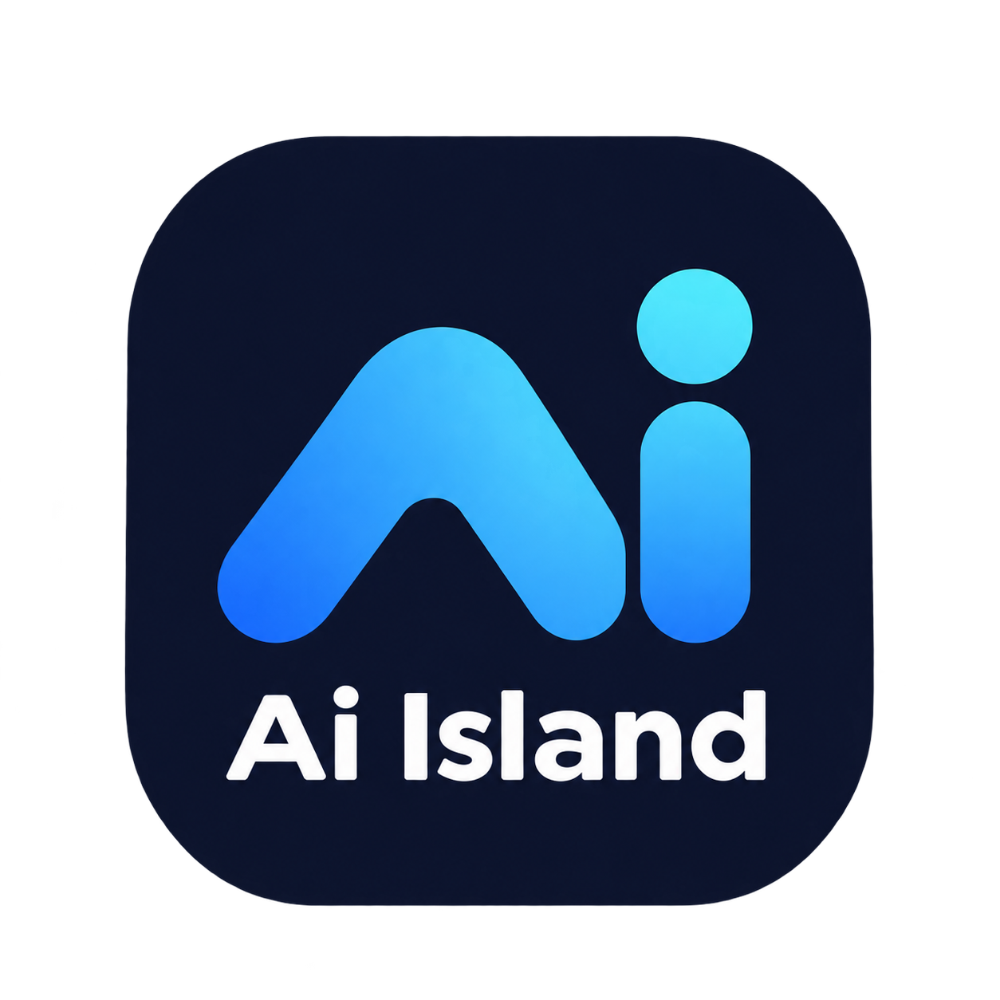

# AI Island

<p align="center">
  
</p>

Windows 桌面上的灵动岛式状态面板，使用 C#、.NET 8 和 WPF 开发。集中展示 Codex / Claude CLI 会话、系统资源、音乐播放、系统代理和账户余额，支持托盘常驻与开机启动。

## 功能

| 模块 | 功能 |
| --- | --- |
| AI 会话 | 通过 Hook 接收 Codex、Claude 会话事件，展示任务状态、等待确认、完成和失败；支持暂停监控和尝试定位关联终端 |
| 系统资源 | 展示 CPU、内存使用率与磁盘容量 |
| 音乐 | 接入 QQ 音乐、网易云音乐的 Windows 媒体会话，展示曲目、封面和进度，支持播放 / 暂停、上一首、下一首 |
| 系统代理 | 读取 Clash Verge Rev 配置，展示并切换 Windows 系统代理；检测到代理冲突或代理守卫时限制操作 |
| 账户余额 | 查询 `xc.lifesecretary.com` 账户余额，支持手动和定时刷新 |
| 外观与交互 | 拖动定位、顶部对齐、模块开关与排序、动画、彩虹 / 单色灯条及静态 / 跑马灯 / 呼吸效果 |

AI 模块固定在上方，其他模块可在设置中调整顺序。任务结束 / 失败通知与等待确认通知可分别开关。

## 环境

- Windows 桌面环境；项目目标框架为 `net8.0-windows10.0.19041.0`，建议 Windows 10 2004 或更新版本。
- 源码构建需要 .NET 8 SDK 和 PowerShell。脚本优先使用项目内 `.dotnet/dotnet.exe`，不存在时使用 PATH 中的 `dotnet`。
- 普通发布的主程序需要 .NET 8 Windows Desktop Runtime；Hook 桥接程序需要 .NET 8 Runtime。开发机安装相应 SDK 后可运行。
- 单文件打包面向 Windows x64，主程序自带运行时；Hook 仍单独发布，不包含在主程序单文件中。
- 首次还原或打包需要下载对应 NuGet 依赖和运行时包。

## 构建与运行

在项目根目录执行。重新构建或打包前，先从托盘菜单退出正在运行的 AI Island。

```powershell
powershell -NoProfile -ExecutionPolicy Bypass -File scripts/build.ps1
```

脚本构建解决方案，并发布到以下目录：

| 输出 | 用途 |
| --- | --- |
| `artifacts/app/` | WPF 主程序及运行依赖 |
| `artifacts/hook/` | CLI Hook 桥接程序及运行依赖 |

启动主程序：

```powershell
.\artifacts\app\AIIsland.exe
```

右键面板或托盘图标打开设置、暂停 / 恢复 AI 监控或退出。设置修改后点击「保存」。同一 Windows 用户重复启动时仅保留一个实例。

### 单文件打包

```powershell
powershell -NoProfile -ExecutionPolicy Bypass -File scripts/package.ps1
```

脚本先执行构建，再生成自包含的 Windows x64 主程序，输出到 `artifacts/package/app/`，并复制为项目根目录的 `AIIsland.exe`。

## CLI Hook 接入

先执行构建，确保 `artifacts/hook/AIIsland.Hook.exe` 存在，然后安装：

```powershell
# 同时接入 Codex 和 Claude
powershell -NoProfile -ExecutionPolicy Bypass -File scripts/Install-Hooks.ps1

# 只接入一种 CLI，Provider 可选 Codex、Claude、Both
powershell -NoProfile -ExecutionPolicy Bypass -File scripts/Install-Hooks.ps1 -Provider Codex

# 移除本项目安装的 Hook
powershell -NoProfile -ExecutionPolicy Bypass -File scripts/Install-Hooks.ps1 -Uninstall
```

安装脚本合并 Hook 配置，并在修改已有配置前生成 `.ai-island-<标识>.bak` 备份。默认配置位置：

| CLI | 配置位置 |
| --- | --- |
| Codex | `%USERPROFILE%/.codex/hooks.json`；设置了 `CODEX_HOME` 时使用该目录 |
| Claude | `%USERPROFILE%/.claude/settings.json`；设置了 `CLAUDE_CONFIG_DIR` 时使用该目录 |

也可传入 `-ConfigRoot <目录>`，脚本会使用该目录下的 `.codex` 和 `.claude` 子目录。

安装后重启 CLI 会话；若 Codex 提示审核 Hook，按其 `/hooks` 界面提示操作。接入需要 CLI 版本支持脚本注册的 Hook 事件。安装脚本写入桥接程序的绝对路径，因此移动项目后需要重新安装 Hook，并保留 `artifacts/hook/` 中的完整运行文件。

## 配置与数据

数据保存在当前 Windows 用户的 `%LOCALAPPDATA%/AIIsland/`，与源码目录分开：

| 路径 | 内容 |
| --- | --- |
| `settings.json` | 模块开关、顺序、外观、位置、通知、余额账户配置等 |
| `balance-token.dat` | 加密的余额登录 token 缓存 |
| `inbox/` | 等待主程序消费的 Hook 事件文件 |
| `inbox/sessions/` | 用于恢复在线会话的会话标识、项目目录及进程信息 |

重启程序或电脑不会清空已保存的设置。配置文件缺失、损坏或无法读取时，程序使用默认设置。开机启动通过当前用户注册表的 `Software\Microsoft\Windows\CurrentVersion\Run` 配置。

余额密码在 `settings.json` 中加密保存，token 另行加密缓存，均绑定当前 Windows 用户。余额刷新间隔支持 10–86400 秒，设置为 0 时仅手动刷新；token 失效时会尝试重新登录。

Hook 桥接程序不记录原始提示词、回答或工具参数，只写入状态同步所需的元数据。Codex 完成状态补偿会读取本机会话记录。余额模块启用后会向对应服务发起登录和查询请求。

## 项目结构

```text
AIIsland/                 WPF 主程序
  Assets/                 应用图标
  Core/                   会话状态与注册信息
  Modules/                AI、音乐、代理、资源和余额模块
  Services/               设置、事件读取、系统接口等服务
  UI/                     面板、设置窗口与控件
AIIsland.Hook/            CLI 事件桥接程序
scripts/
  build.ps1               构建并发布主程序与 Hook
  package.ps1             打包 Windows x64 自包含主程序
  Install-Hooks.ps1       安装 / 卸载 CLI Hook
AIIsland.sln              解决方案
NuGet.Config              NuGet 源配置
logo.png                  项目标识
```

## 常见问题

- **AI 会话没有任务状态**：确认对应模块已启用、Hook 已安装，重启 CLI 后提交一次任务；右键面板查看「监控接入状态」。仅发现 Agent 进程不代表已经收到 Hook 事件。
- **重启后会话仍在线但任务状态未恢复**：在线会话信息可以恢复，当前任务状态需要等待新的 Hook 同步；已退出进程不会作为在线会话恢复。
- **直接关闭 PowerShell 后的退出监控**：会话同时跟踪 Agent 和启动它的 shell 进程。即使未收到退出 Hook、Agent 子进程仍存活，shell 退出后也会在下一次刷新时判定会话离线。更新前已经关闭终端的旧会话可能缺少 shell 信息；更新后重新启动 CLI 会话即可完整记录。
- **音乐没有信息或无法控制**：需要音乐客户端运行并提供 Windows 媒体会话，具体可用操作取决于客户端暴露的能力。
- **代理开关不可用**：检查 Clash Verge Rev 是否运行、配置能否读取，以及是否存在代理守卫、PAC 或其他代理冲突。
- **无法直接跳转到终端标签页**：程序只在能够可靠关联时激活终端窗口；多标签页仍需手动选择，无法定位时会显示提示。
- **打包提示程序正在运行**：先从托盘退出 AI Island，再重新执行打包脚本。
